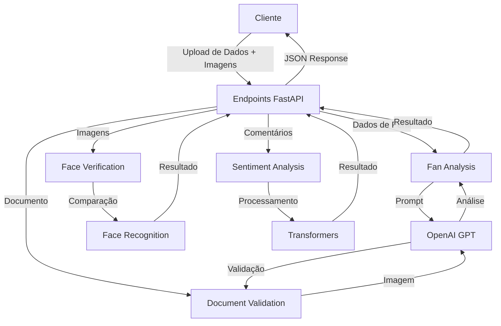

# KNOW YOUR FAN AI API

<div align="center">
  <p><em>API de inteligência artificial para análise de perfil de fãs de eSports</em></p>
  
  [](https://fastapi.tiangolo.com/)
  [](https://www.python.org/)
  [](https://github.com/ageitgey/face_recognition)
  [](https://openai.com/)
</div>

## 📋 Visão Geral

O **Know Your Fan AI API** é uma plataforma de inteligência artificial projetada para analisar dados de fãs de eSports e realizar verificação de identidade através de reconhecimento facial. Desenvolvido para criar perfis detalhados de fãs, o sistema classifica usuários com base em seu engajamento, preferências de conteúdo e potencial de monetização.

## ✨ Destaques

- **Análise Avançada de Perfil de Fãs** - Classificação por tipo de engajamento e potencial
- **Verificação Facial Segura** - Comparação de selfie com documento oficial
- **Validação de Documentos** - Análise automatizada de RGs brasileiros
- **Análise de Sentimento** - Processamento de comentários para medir percepção da comunidade
- **Geração de Chatbot Personalizado** - Prompts customizados baseados no perfil do fã
- **API Modular e Escalável** - Arquitetura robusta com endpoints especializados

## 🛠️ Tecnologias Utilizadas

| Tecnologia            | Descrição                                       |
| --------------------- | ----------------------------------------------- |
| **FastAPI**           | Framework para construção de APIs eficientes    |
| **Face Recognition**  | Biblioteca para reconhecimento facial           |
| **Pydantic**          | Validação de dados e criação de modelos         |
| **OpenAI API**        | Processamento avançado de linguagem natural     |
| **Transformers**      | Análise de sentimento via modelos pré-treinados |
| **OpenCV**            | Processamento e análise de imagens              |
| **Python**            | Linguagem principal de desenvolvimento          |

## 📸 Arquitetura do Sistema

<div align="center">
  
  <p><em>Fluxo de processamento de dados</em></p>
</div>

## 🧰 Estrutura do Projeto

```
ai-services/
├── main.py                     # Inicialização da API
├── models/                     # Modelos de dados
│   ├── fan_data.py             # Representação de fãs
│   ├── comments_data.py        # Estrutura para análise de sentimentos
│   └── ia_message_data.py      # Formato de mensagens para IA
├── routes/                     # Endpoints da API
│   ├── fan_analysis_route.py   # Rota para análise de perfil
│   ├── face_validator_route.py # Rota para verificação facial
│   ├── sentiment_analysis_route.py # Rota para análise de sentimentos
│   └── document_validator_route.py # Rota para validação de documentos
├── services/                   # Lógica de negócios
│   ├── fan_analysis.py         # Serviço de análise de perfil
│   ├── face_validator.py       # Serviço de validação facial
│   ├── sentiment_analysis.py   # Serviço de análise de sentimentos
│   └── document_validator.py   # Serviço de validação de documentos
└── utils/                      # Funções utilitárias
    ├── file_utils.py           # Manipulação de arquivos
    └── openai_request.py       # Interface com a API da OpenAI
```

## 🔄 Fluxo de Dados



## 📊 Endpoints da API

### 1. **Análise de Perfil de Fãs**

- **Rota**: `/fanAnalyze/`
- **Método**: `POST`
- **Funcionalidade**: Analisa dados de perfil, selfie e documento do fã
- **Retorno**: Classificação de fã, score de engajamento, preferências e potencial

### 2. **Verificação Facial**

- **Rota**: `/faceVerify/`
- **Método**: `POST`
- **Funcionalidade**: Compara selfie com foto do documento
- **Retorno**: Status de verificação e score de similaridade

### 3. **Validação de Documento**

- **Rota**: `/documentVerify/`
- **Método**: `POST`
- **Funcionalidade**: Analisa RG brasileiro para verificar autenticidade
- **Retorno**: Status de validação e relatório de avaliação

### 4. **Análise de Sentimento**

- **Rota**: `/sentimentAnalyze/`
- **Método**: `POST`
- **Funcionalidade**: Processa comentários para detectar sentimento geral
- **Retorno**: Contagem de sentimentos positivos/negativos e índice normalizado

## 🔧 Instalação e Configuração

### Pré-requisitos

- Python 3.9+
- pip (gerenciador de pacotes Python)
- Docker (opcional, mas recomendado)
- Chave de API da OpenAI

### Passos para Instalação

1. **Clone o repositório**

   ```bash
   git clone https://github.com/sua-organizacao/know-your-fan.git
   cd know-your-fan/ai-services
   ```

2. **Crie e ative um ambiente virtual**

   ```bash
   python -m venv venv
   
   # No Windows
   venv\Scripts\activate
   
   # No Linux/Mac
   source venv/bin/activate
   ```

3. **Instale as dependências**

   ```bash
   pip install -r requirements.txt
   ```

4. **Configure as variáveis de ambiente**

   Crie um arquivo `.env` na raiz do projeto:

   ```env
   OPENAI_API_KEY=sua_chave_api_aqui
   OPENAI_API_MODEL=gpt-4-turbo-preview
   ```

5. **Configuração para reconhecimento facial (importante)**

   No Windows, você pode precisar instalar o Visual Studio C++ Build Tools e CMake. Para Linux, certifique-se de ter as dependências do dlib instaladas:

   ```bash
   # Ubuntu/Debian
   sudo apt-get install -y build-essential cmake libopenblas-dev liblapack-dev libx11-dev libgtk-3-dev
   
   # Fedora/RHEL
   sudo dnf install cmake gcc-c++ openblas-devel lapack-devel libX11-devel gtk3-devel
   ```

6. **Iniciar o servidor**

   ```bash
   uvicorn main:app --reload
   ```

   O servidor estará disponível em `http://127.0.0.1:8000`

### Instalação com Docker

1. **Construa a imagem Docker**

   ```bash
   docker build -t know-your-fan-api .
   ```

2. **Execute o contêiner**

   ```bash
   docker run -p 8000:8000 -e OPENAI_API_KEY=sua_chave_api_aqui know-your-fan-api
   ```

## 📝 Guia de Uso

### Análise de Perfil de Fã

```bash
curl -X POST "http://localhost:8000/fanAnalyze/" \
  -H "Content-Type: multipart/form-data" \
  -F "data={\"fullName\":\"João Silva\",\"nickname\":\"FuriaFan\",\"email\":\"joao@email.com\",\"username\":\"joaosilva\",\"password\":\"senha123\",\"cpf\":\"12345678900\",\"location\":\"São Paulo\",\"socials\":[\"Twitter\",\"Instagram\",\"Facebook\"],\"ecommerce\":[\"Já comprei e uso com orgulho\"],\"content\":[\"CS:GO\",\"CS:GO\",\"Valorant\"]}" \
  -F "selfie=@caminho/para/selfie.jpg" \
  -F "document=@caminho/para/documento.jpg"
```

### Verificação Facial

```bash
curl -X POST "http://localhost:8000/faceVerify/" \
  -H "Content-Type: multipart/form-data" \
  -F "cpf=12345678900" \
  -F "selfie=@caminho/para/selfie.jpg" \
  -F "document=@caminho/para/documento.jpg"
```

### Análise de Sentimento

```bash
curl -X POST "http://localhost:8000/sentimentAnalyze/" \
  -H "Content-Type: application/json" \
  -d '{"comments": ["Adorei o último jogo da FURIA", "Esse time é o melhor", "Precisam melhorar a defesa"]}'
```

## 🔍 Documentação Interativa

A API inclui documentação interativa automática gerada pelo FastAPI:

- **Swagger UI**: Disponível em `http://localhost:8000/docs`
- **ReDoc**: Disponível em `http://localhost:8000/redoc`

## 🧩 Personalização e Extensão

### Adicionando Novos Modelos de Dados

1. Crie um novo arquivo na pasta `models/` seguindo o padrão Pydantic
2. Importe e utilize o modelo nas rotas ou serviços relevantes

### Criando Novos Endpoints

1. Adicione um novo arquivo na pasta `routes/`
2. Defina um router e implemente os endpoints necessários
3. Registre o router em `main.py`

### Modificando o Prompt do Sistema para Análise

Para customizar a análise de fãs, edite o arquivo `services/fan_analysis.py`:

```python
prompt = f"""
    Você é um especialista em marketing e comportamento de fãs de e-sports.
    
    # Adicione suas instruções personalizadas aqui
    
    ### Dados do fã:
    - Nome: {fan.fullName}
    ...
"""
```

## 📈 Roadmap de Melhorias Futuras

- [ ] **Integração com Redes Sociais** - Análise automatizada de perfis
- [ ] **Análise de Vídeo** - Reconhecimento de emoções em reações de fãs
- [ ] **Dashboard Administrativo** - Interface visual para gestão de dados
- [ ] **Autenticação por JWT** - Segurança aprimorada para os endpoints
- [ ] **Cache Distribuído** - Melhor performance para requisições frequentes
- [ ] **Processamento em Batch** - Análise de múltiplos perfis simultaneamente

## 📝 Licença

Este projeto está licenciado sob a MIT License.

## 🙏 Agradecimentos

- Comunidade FastAPI
- Contribuidores do projeto face_recognition
- OpenAI pela tecnologia de processamento de linguagem natural

---

<div align="center">
  <p>Desenvolvido com ❤️ para entender e conectar fãs de eSports</p>
</div>