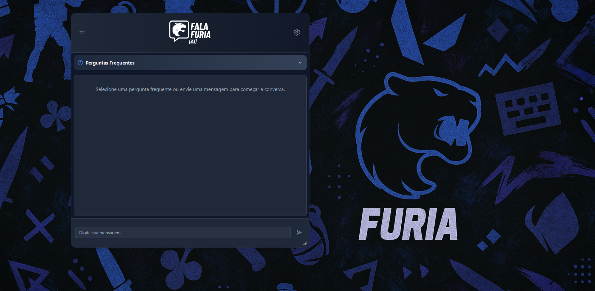
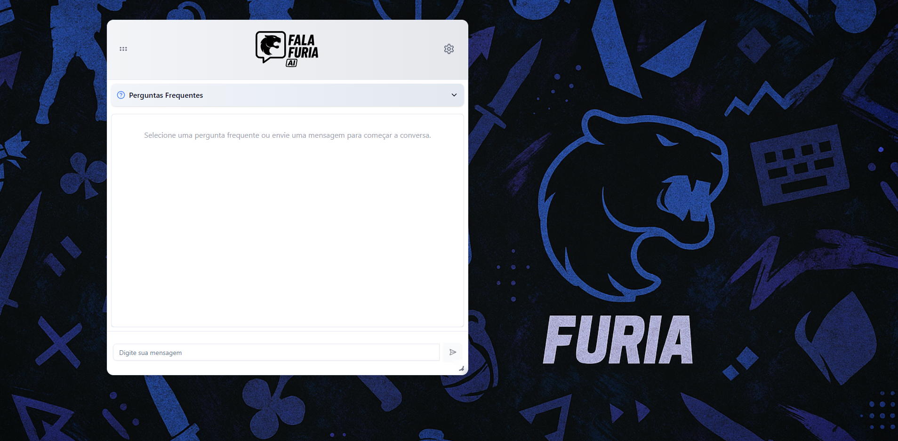
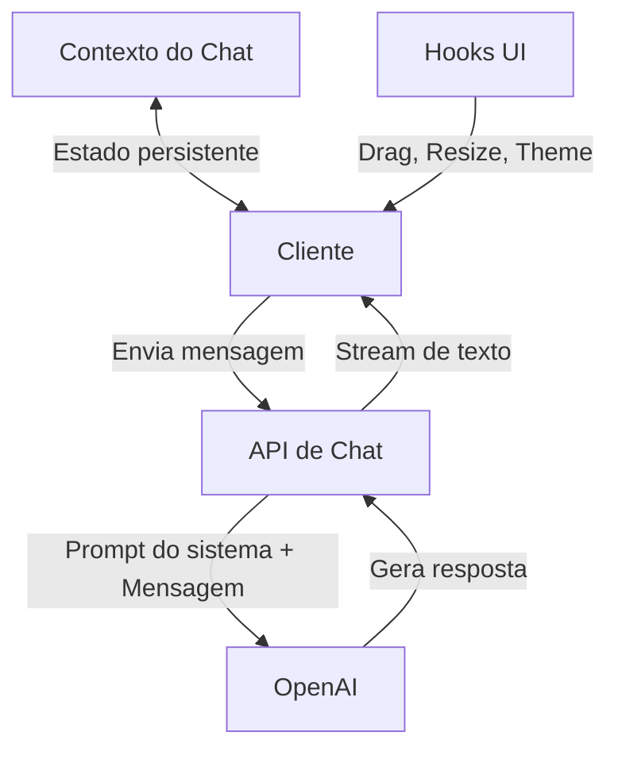

# FALAFURIA CHATBOT

<div align="center">
  
  <p><em>Assistente virtual interativo especializado no time de CS:GO da FURIA</em></p>
  
  [](https://nextjs.org/)
  [](https://www.typescriptlang.org/)
  [](https://tailwindcss.com/)
  [](https://openai.com/)
</div>

## 📋 Visão Geral

O FALAFURIA é um assistente virtual inteligente que fornece informações sobre o time de CS:GO da FURIA Esports. Desenvolvido como parte de um processo seletivo, o chatbot oferece uma experiência conversacional fluida com personalidade descontraída, alinhada à identidade da marca.

## ✨ Destaques

- **Interface de Chat Interativa e Responsiva** - Janela arrastável e redimensionável
- **Assistente com IA Avançada** - Integração com modelos GPT da OpenAI
- **Perguntas Frequentes Organizadas** - Acesso rápido por categorias
- **Design Temático da FURIA** - Identidade visual alinhada com a marca
- **Modo Claro/Escuro** - Adaptação visual conforme preferência do usuário
- **Personalização de Interface** - Opções de tamanho de fonte e layout

## 🛠️ Tecnologias Utilizadas

| Tecnologia        | Descrição                                       |
| ----------------- | ----------------------------------------------- |
| **Next.js**       | Framework React para frontend                   |
| **TypeScript**    | Linguagem com tipagem estática                  |
| **Tailwind CSS**  | Utilitários CSS para estilização                |
| **Vercel AI SDK** | Integração com modelos de IA                    |
| **OpenAI API**    | Backend para processamento de linguagem natural |
| **Shadcn/UI**     | Componentes de interface acessíveis             |

## 📸 Capturas de Tela

<div align="center">
  
  <p><em>Modo Escuro</em></p>
  
  
  <p><em>Modo Claro</em></p>
</div>

## 🧰 Arquitetura do Projeto

### Estrutura de Diretórios

```
src/
├── app/                # App Router e API Routes
├── components/         # Componentes React reutilizáveis
├── contexts/           # Gerenciamento de estado global
├── data/               # Dados estáticos e configurações
├── hooks/              # Lógica customizada para UI e comportamento
└── utils/              # Funções utilitárias
```

### Fluxo de Dados



## 🔧 Instalação e Configuração

### Pré-requisitos

- Node.js (versão LTS recomendada: 18+)
- Gerenciador de pacotes (npm, yarn ou pnpm)
- Chave de API da OpenAI

### Passos para Instalação

1. **Clone o repositório**

   ```bash
   git clone https://github.com/seu-usuario/falafuria-chatbot.git
   cd falafuria-chatbot
   ```

2. **Instale as dependências**

   ```bash
   npm install
   # ou
   yarn install
   # ou
   pnpm install
   ```

3. **Configure a API da OpenAI**

   Crie um arquivo `.env.local` na raiz do projeto:

   ```env
   OPENAI_API_KEY=sua_chave_api_aqui
   ```

   > **Importante sobre a API da OpenAI:**
   >
   > 1. Acesse: https://openai.com/
   > 2. No canto superior direito, clique em "Log in" e em "API Platform"
   > 3. Faça login e pesquise "API keys" na barra lateral esquerda
   > 4. Clique em "+ Create new secret key"
   > 5. Defina um nome, mantenha o projeto default com todas as permissões
   > 6. Copie o código de acesso gerado
   >    **Nota sobre custos:** O projeto usa o modelo gpt-4.1-nano, gratuito até a data de publicação, mas com algumas limitações (sem acesso à internet, dados até outubro/2023).

4. **Inicie o servidor de desenvolvimento**

   ```bash
   npm run dev
   # ou
   yarn dev
   # ou
   pnpm dev
   ```

5. Acesse o chat em [http://localhost:3000](http://localhost:3000)

## 🖱️ Guia de Uso

A interface de chat oferece múltiplas formas de interação:

- **Movimentação:** Clique e segure o cabeçalho para mover a janela de chat
- **Redimensionamento:** Arraste o canto inferior direito para ajustar o tamanho
- **Envio de mensagens:** Digite no campo de entrada e pressione Enviar ou Enter
- **Perguntas rápidas:** Acesse a aba "Perguntas Frequentes" e selecione uma opção
- **Personalização:** Clique no ícone de engrenagem para ajustar tema e tamanho da fonte

### Atalhos de Teclado

- **Tab:** Navegue entre os elementos interativos
- **Enter/Espaço:** Ative botões e controles
- **Escape:** Feche diálogos ou cancele operações em andamento

## 🧩 Personalização e Extensão

### Modificar o Estilo Visual

Para alterar cores e estilos:

1. Edite o arquivo `tailwind.config.js` para modificar o tema global
2. Use classes Tailwind nos componentes para alterações específicas

### Adicionar Novas Categorias de FAQ

Edite o arquivo `src/data/frequentQuestions.ts`:

```typescript
export const QUESTION_CATEGORIES: QuestionCategory[] = [
  {
    title: "Nova Categoria",
    questions: ["Pergunta 1?", "Pergunta 2?"],
  },
  // Categorias existentes...
];
```

### Modificar o Prompt do Sistema

Para alterar a personalidade ou conhecimento do assistente, edite o arquivo `src/app/api/chat/route.ts`:

```typescript
const systemPrompt = {
  role: "system",
  content: "Seu novo prompt aqui...",
};
```

## 📈 Roadmap de Melhorias Futuras

- [ ] **Autenticação de Usuários** - Perfis personalizados e histórico persistente
- [ ] **Base de Conhecimento Expandida** - Dados específicos da FURIA via embeddings
- [ ] **Integração de Mídia Social** - Feed ao vivo de postagens da FURIA
- [ ] **Interface por Voz** - Interação através de reconhecimento e síntese de fala
- [ ] **Multilíngue** - Suporte a múltiplos idiomas para alcance global
- [ ] **App Móvel via PWA** - Experiência nativa em dispositivos móveis

## 📜 Licença

Este projeto foi desenvolvido como parte de um processo seletivo. Uso e distribuição restritos conforme acordado com a FURIA Esports.

## 🙏 Agradecimentos

- Equipe da FURIA pela oportunidade
- Comunidade Next.js e React
- OpenAI pela tecnologia de processamento de linguagem natural

---

<div align="center">
  <p>Desenvolvido com 💙 para o processo seletivo da FURIA</p>
</div>
