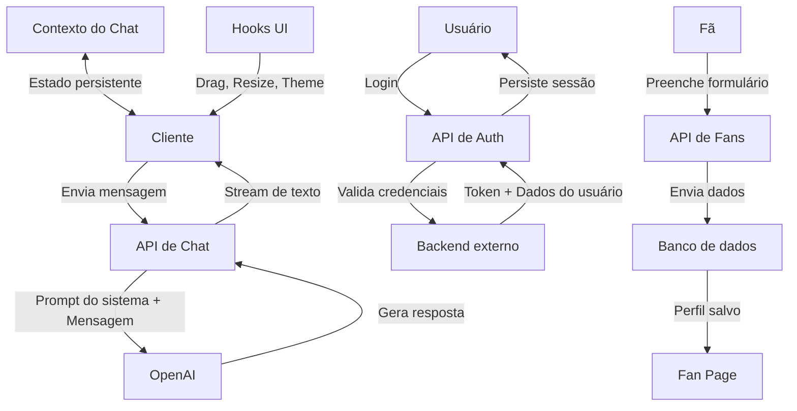

# FALAFURIA CHATBOT

<div align="center">
  
  <p><em>Assistente virtual interativo especializado no time de CS:GO da FURIA</em></p>
  
  [](https://nextjs.org/)
  [](https://www.typescriptlang.org/)
  [](https://tailwindcss.com/)
  [](https://openai.com/)
</div>

## 📋 Visão Geral

O FALAFURIA é um assistente virtual inteligente que fornece informações sobre o time da FURIA Esports. Desenvolvido como parte de um processo seletivo, o chatbot oferece uma experiência conversacional fluida com personalidade descontraída, alinhada à identidade da marca.


## ✨ Destaques

- **Interface de Chat Interativa e Responsiva** - Janela arrastável e redimensionável
- **Assistente com IA Avançada personalisada ao usuario** - Integração com modelos GPT da OpenAI
- **Perguntas Frequentes Organizadas** - Acesso rápido por categorias
- **Design Temático da FURIA** - Identidade visual alinhada com a marca
- **Modo Claro/Escuro** - Adaptação visual conforme preferência do usuário
- **Personalização de Interface** - Opções de tamanho de fonte e layout
- **Sistema de Autenticação** - Login, recuperação de senha e persistência de usuário
- **Validação de Identidade** - Recursos para validação de documentos e selfies
- **Portal do Fã** - Página personalizada com perfil e estatísticas do usuário
- **Dashboard Analítico** - Visualizações de dados dos fãs com gráficos interativos
- **Formulário de Cadastro** - Processo de registro com validação de identidade


## 🛠️ Tecnologias Utilizadas

| Tecnologia        | Descrição                                       |
| ----------------- | ----------------------------------------------- |
| **Next.js**       | Framework React para frontend                   |
| **TypeScript**    | Linguagem com tipagem estática                  |
| **Tailwind CSS**  | Utilitários CSS para estilização                |
| **Vercel AI SDK** | Integração com modelos de IA                    |
| **OpenAI API**    | Backend para processamento de linguagem natural |
| **Shadcn/UI**     | Componentes de interface acessíveis             |
| **Recharts**      | Biblioteca para visualização de dados           |

## 📸 Capturas de Tela

<div align="center">
  
  <p><em>Modo Escuro</em></p>
  
  
  <p><em>Modo Claro</em></p>
</div>

## 🧰 Arquitetura do Projeto

### Estrutura de Diretórios

```
src/
├── app/                # App Router e API Routes
│   ├── analytics/      # Dashboard analítico
│   ├── api/            # Backend API routes
│   │   ├── auth/       # Autenticação
│   │   ├── chat/       # Integração com OpenAI
│   │   └── fans/       # Gerenciamento de dados de fãs
│   ├── chat/           # Interface principal do chatbot
│   ├── fan-page/       # Página personalizada do usuário
│   ├── form/           # Formulário de cadastro
│   ├── login/          # Página de login
│   └── forgot-password/# Recuperação de senha
├── components/         # Componentes React reutilizáveis
│   ├── auth/           # Componentes de autenticação
│   ├── charts/         # Visualizações gráficas
│   ├── Chat/           # Interface de conversa
│   ├── form/           # Elementos de formulário
│   ├── layout/         # Estruturas de layout
│   ├── theme/          # Configuração de temas
│   └── ui/             # Componentes de interface
├── contexts/           # Gerenciamento de estado global
├── data/               # Dados estáticos e configurações
├── hooks/              # Lógica customizada para UI e comportamento
└── utils/              # Funções utilitárias
```
### Fluxo de Dados


## 🔧 Instalação e Configuração

### Pré-requisitos

- Node.js (versão LTS recomendada: 18+)
- Gerenciador de pacotes (npm, yarn ou pnpm)
- Chave de API da OpenAI

### Passos para Instalação

1. **Clone o repositório**

   ```bash
   git clone https://github.com/seu-usuario/falafuria-chatbot.git
   cd falafuria-chatbot
   ```

2. **Instale as dependências**

   ```bash
   npm install
   # ou
   yarn install
   # ou
   pnpm install
   ```

3. **Configure a API da OpenAI**

   Crie um arquivo `.env.local` na raiz do projeto:

   ```env
   OPENAI_API_KEY=sua_chave_api_aqui
   ```

   > **Importante sobre a API da OpenAI:**
   >
   > 1. Acesse: https://openai.com/
   > 2. No canto superior direito, clique em "Log in" e em "API Platform"
   > 3. Faça login e pesquise "API keys" na barra lateral esquerda
   > 4. Clique em "+ Create new secret key"
   > 5. Defina um nome, mantenha o projeto default com todas as permissões
   > 6. Copie o código de acesso gerado
   >    **Nota sobre custos:** O projeto usa o modelo gpt-4.1-nano, gratuito até a data de publicação, mas com algumas limitações (sem acesso à internet, dados até outubro/2023).

4. **Configuração do Backend (opcional)**

   Por padrão, a aplicação usa um backend simulado em http://localhost:4000. Para integrar com um backend real:

5. **Inicie o servidor de desenvolvimento**

   ```bash
   npm run dev
   # ou
   yarn dev
   # ou
   pnpm dev
   ```

5. Acesse o chat em [http://localhost:3000](http://localhost:3000)

## 🖱️ Guia de Uso

### Sistema de Autenticação

- **Login:** Acesse usando credenciais de usuário ou admin (admin/admin)
- **Recuperação de Senha:** Fluxo completo para redefinição de senha
- **Personalização:** O sistema adapta o prompt do chatbot ao perfil do usuário logado

### Interface do Chat

- **Movimentação:** Clique e segure o cabeçalho para mover a janela de chat
- **Redimensionamento:** Arraste o canto inferior direito para ajustar o tamanho
- **Envio de mensagens:** Digite no campo de entrada e pressione Enviar ou Enter
- **Perguntas rápidas:** Acesse a aba "Perguntas Frequentes" e selecione uma opção
- **Personalização:** Clique no ícone de engrenagem para ajustar tema e tamanho da fonte

### Página do Fã

- Visualize seu perfil completo como fã da FURIA
- Consulte interesses, eventos, compras e engajamento
- Verifique redes sociais vinculadas e status de verificação de identidade

### Dashboard Analítico (Apenas para ADMs no login (admin/admin))

- Explore visualizações interativas de dados
- Análise de jogos favoritos, redes sociais e distribuição geográfica
- Métricas de comportamento dos fãs

### Formulário de Cadastro

- Processo completo para registro de novos fãs
- Upload de documentos para verificação de identidade
- Coleta de dados de contato e preferências

### Atalhos de Teclado

- **Tab:** Navegue entre os elementos interativos
- **Enter/Espaço:** Ative botões e controles
- **Escape:** Feche diálogos ou cancele operações em andamento

## 🧩 Personalização e Extensão

### Modificar o Estilo Visual

Para alterar cores e estilos:

1. Edite o arquivo `tailwind.config.js` para modificar o tema global
2. Use classes Tailwind nos componentes para alterações específicas
3. Ajuste os temas claro/escuro em `src/app/globals.css`

### Adicionar Novas Categorias de FAQ

Edite o arquivo `src/data/frequentQuestions.ts`:

```typescript
export const QUESTION_CATEGORIES: QuestionCategory[] = [
  {
    title: "Nova Categoria",
    questions: ["Pergunta 1?", "Pergunta 2?"],
  },
  // Categorias existentes...
];
```

### Modificar o Prompt do Sistema

Para alterar a personalidade ou conhecimento do assistente, edite o arquivo `src/app/api/chat/route.ts`:

```typescript
const systemPrompt = {
  role: "system",
  content: "Seu novo prompt aqui...",
};
```

### Adicionar Novos Gráficos

Para adicionar uma nova visualização, crie um componente em `src/components/charts/` e adicione ao arquivo `src/app/analytics/page.tsx`.

## 📈 Roadmap de Melhorias Futuras

- [ ] **Integração com APIs de Redes Sociais** - Dados de curtidas, seguidores e estatísticas
- [ ] **Integração de Mídia Social** - Feed ao vivo de postagens da FURIA
- [ ] **Sistema de Recompensas** - Gamificação para engajamento dos fãs
- [ ] **Personalização Avançada** - Mais opções de personalização do assistente
- [ ] **Base de Conhecimento Expandida** - Dados específicos da FURIA via embeddings
- [ ] **Interface por Voz** - Interação através de reconhecimento e síntese de fala
- [ ] **Multilíngue** - Suporte a múltiplos idiomas para alcance global
- [ ] **App Móvel via PWA** - Experiência nativa em dispositivos móveis

## 📜 Licença

Este projeto foi desenvolvido como parte de um processo seletivo. Uso e distribuição restritos conforme acordado com a FURIA Esports.

## 🙏 Agradecimentos

- Equipe da FURIA pela oportunidade
- Comunidade Next.js e React
- OpenAI pela tecnologia de processamento de linguagem natural

---

<div align="center">
  <p>Desenvolvido com 💙 para o processo seletivo da FURIA</p>
</div>
